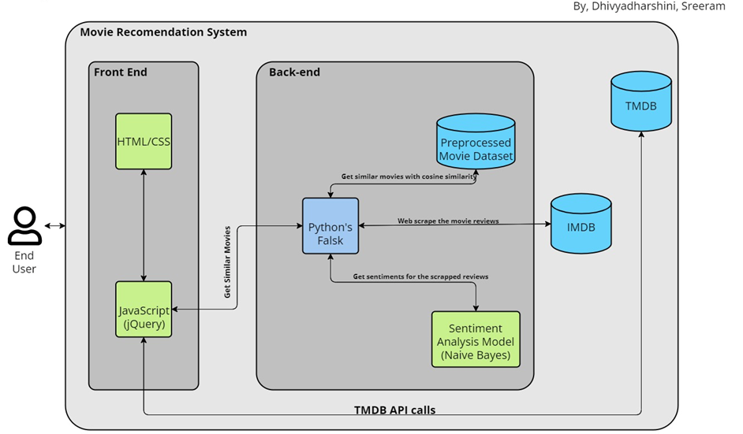
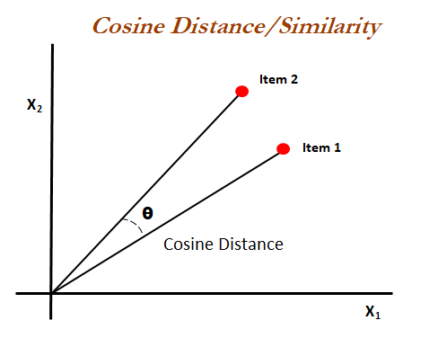

# ML Based Movie Recommendation System
Recommender systems are an important class of machine learning algorithms that offer “relevant” suggestions to users. YouTube, Amazon, Netflix, all function on recommendation systems where the system recommends you the next video or product based on your past activity (Content-based Filtering) or based on activities and preferences of other users similar to you (Collaborative Filtering). Recommendation Systems work based on the similarity between either the content or the users who access the content. Recommender systems encompass a class of techniques and algorithms that can suggest “relevant” items to users. They predict future behavior based on past data through a multitude of techniques. It’s an advanced filtration mechanism that predicts the possible movie choices of the concerned user and their preferences towards a domain-specific item, aka movie. There are several ways to
measure the similarity between two items. The recommendation systems use this similarity matrix to recommend the next most similar product to the user.
In this project, A content-based recommender system that recommends movies similar to the movie the user likes and analyses the sentiments of the reviews given by the user and will be
implemented with the Frontend also. Movie recommendation system an ML-based approach to filtering or predicting the user's recommendations based on the input of the movie name.
This model would be based on Cosine Similarity and the analysis of sentiments will be based on Naïve Bayes Algorithm. 

## Overview

The content of the movie you input or choose is taken into consideration when suggesting movies. The genre, the director, and the top three casts are the primary factors taken into account while making suggestions. Titles, genres, runtimes, ratings, posters, casts, and other movie details are retrieved from [TMDB](https://www.themoviedb.org/documentation/api). With the aid of `beautifulsoup4}, user reviews of every movie are "web-scraped" from the IMDB website and then passed through sentiment analysis, where a model determines if the review is favorable or unfavorable.

## Getting the API key?

Go to https://www.themoviedb.org/ and create an account. After creating an account successfully, go to your account settings, click the `API` link in the left-hand sidebar, and complete the application to request an API key. If you don't have a website URL, simply respond with "NA" when requested. Once your request has been approved, you will see the API key in your {API} sidebar.

## How to run the project?

1. Download or clone this repository to your computer.
2. Use the command `pip install -r requirements.txt` to install every library included in the requirements.txt file.
3. Visit https://www.themoviedb.org/ to obtain your API key. (See the section above for information on obtaining the API key.)
3. In the `static/recommend.js} file, replace YOUR_API_KEY in **both** the locations (lines no. 15 and 29) and press save.
4. From your project directory, open a terminal or command prompt. Run the file `main.py` by typing the command `python main.py}.
5. Enter {http://127.0.0.1:5000/} in the address bar of your browser.

## Architecture

## Similarity Score : 

   **How does it determine which item most closely resembles the one the user likes—or, in this case, chooses—?** These are the scores for similarity.
   
   To find out how similar two items are to one another on a scale of zero to one, there is a numerical number that goes from zero to one. The similarity between the text details of the two items is measured in order to get this similarity score. As a result, the similarity score represents the degree of similarity between two items' provided text details. One method for doing this is cosine-similarity.
   
## How does Cosine Similarity work?
  Regardless of the size of the documents, cosine similarity is a metric used to assess how similar they are. The cosine of the angle formed by two vectors projected in a multidimensional space is what is measured mathematically. Because the two comparable documents may still be oriented closer together even if they are far apart by the Euclidean distance (due to document size), cosine similarity is advantageous. The cosine similarity increases with decreasing angle.
  
  

  
More about Cosine Similarity : [Understanding the Math behind Cosine Similarity](https://www.machinelearningplus.com/nlp/cosine-similarity/)

### Dataset Sources

1. [IMDB 5000 Movie Dataset](https://www.kaggle.com/carolzhangdc/imdb-5000-movie-dataset)
2. [The Movies Dataset](https://www.kaggle.com/rounakbanik/the-movies-dataset)
3. [List of movies in 2018](https://en.wikipedia.org/wiki/List_of_American_films_of_2018)
4. [List of movies in 2019](https://en.wikipedia.org/wiki/List_of_American_films_of_2019)
5. [List of movies in 2020](https://en.wikipedia.org/wiki/List_of_American_films_of_2020)

